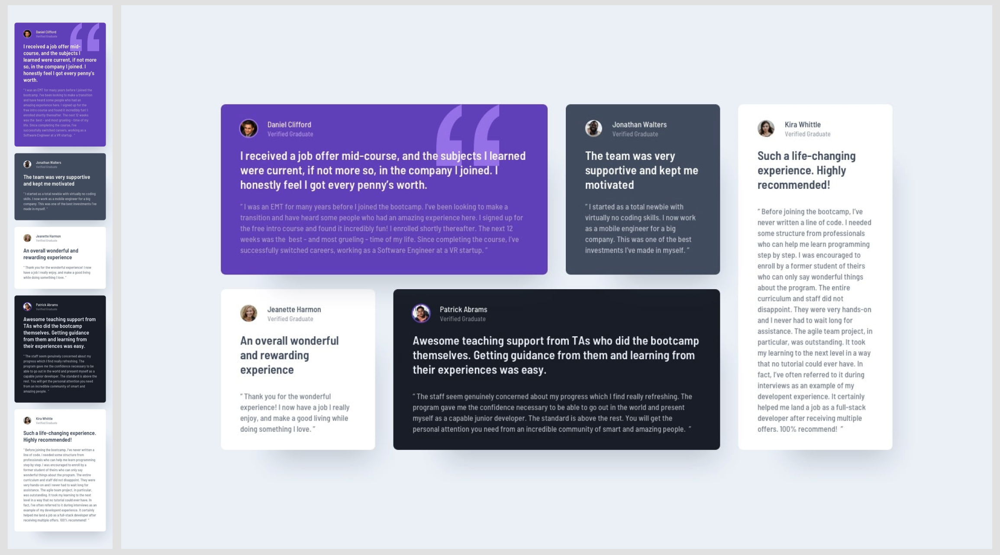

# Testimonials grid section with Bootstrap 5

## Table of contents

- [Overview](#overview)
  - [The challenge](#the-challenge)
  - [Stage](#stage-🏗)
  - [Design to replicate](#design-to-replicate)
  - [Links](#links)
- [My process](#my-process)
  - [Built with](#built-with)
  - [What I learned](#what-i-learned)
- [Author](#author)
- [Support](#support-🖤)

## Overview

### The challenge

Users should be able to:

- View the optimal layout for the site depending on their device's screen size

### Stage 🏗

This project is ongoing, the mediaqueries have to be fixed.

### Design to replicate

### Links

- Code: [https://github1s.com/albavidalm/Testimonials-grid-section](https://github1s.com/albavidalm/Testimonials-grid-section)

- Live Site URL: [https://albavidalm.github.io/Testimonials-grid-section/](https://albavidalm.github.io/Testimonials-grid-section/)

## My process

### Built with

- Semantic HTML5 markup
- Bootstrap 5
- Sass
- Mobile-first workflow

### What I learned

How to use Bootstrap and replicating a design by making it repsonsive.

## Author

- GitHub: [https://github.com/albavidalm](https://github.com/albavidalm)
- Email: [albavidalm @ gmail.com](mailto:albavidalm@gmail.com?subject=Hi)
- Linkedin: [https://www.linkedin.com/in/albavidalm/](https://www.linkedin.com/in/albavidalm/)

## Support 🖤

Sharing is caring, contributions and suggestions are always welcome.
